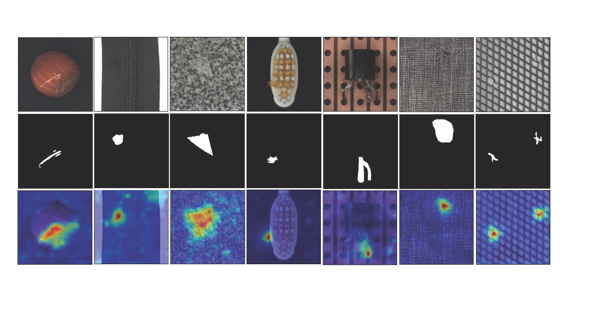

## A Vision Transformer Network with Association Discrepancy for Image Anomaly Detection and Localization


## Overview
<div style="text-align: justify;">
Visual anomaly detection and localization are essential tasks in many safety-critical real-world scenarios. Our approach involves a transformer network with an association discrepancy, combining elements of patch embedding and a reconstruction-based method. We face challenges in capturing rich associations between abnormal patches and the entire image, as anomalies primarily focus on the adjacent patches. However, the nontrivial associations between normal patches and the entire image can be easily expressed by the self-attention weights of each patch. We use a minimax strategy to amplify this association discrepancy, inherently distinguishing between normal and abnormal patches and preserving the positional information of the split patches, which is then processed by a Gaussian mixture density network to pinpoint the regions of anomalies. Extensive experiments conducted on the industrial inspection dataset demonstrate that the proposed method significantly improves visual anomaly detection and localization performance compared to the competing methods.
</div>

## Architecture
<div style="display:flex; justify-content:space-between;">
    
    
</div>

The left diagram illustrates the overall architecture of our approach, with specific details outlined in the paper. On the right, visualized results showcase our method's anomaly detection capabilities on industrial images.
The network is inspired from [Vision Transformer](https://openreview.net/pdf?id=YicbFdNTTy).  It adapts the trasnformer network for image anomaly detection and localization.
## Installation
```bash
$ git clone https://github.com/zsgyj1996/ADViT.git
$ pip install opencv-python
$ pip install scipy

# pytorch
$ pip install torch==1.8.0+cu111 torchvision==0.9.0+cu111 torchaudio==0.8.0 -f https://download.pytorch.org/whl/torch_stable.html

#install faiss
# CPU-only version（currently available on Linux, OSX, and Windows）
$ conda install -c pytorch faiss-cpu
# GPU(+CPU) version （containing both CPU and GPU indices, is available on Linux systems）
$ conda install -c pytorch faiss-gpu
# or for a specific CUDA version
$ conda install -c pytorch faiss-gpu cudatoolkit=10.2 # for CUDA 10.2 
```
## Train (Command Line)
```bash
python train.py -p "hazelnut"
```
## Datasets
**[MVTec Dataset](https://www.mvtec.com/company/research/datasets/mvtec-ad)** - Real world anomaly dataset. contains 5354 high-resolution color and grey images of different texture and object categories.
## Regularization
Gaussian noise has been added to the encoded features from the transformer for regularization.

With added noise, PRO scores significantly surpass those without noise.
## License
This project is under the Apache 2.0 license. See [LICENSE](./LICENSE) for details.
